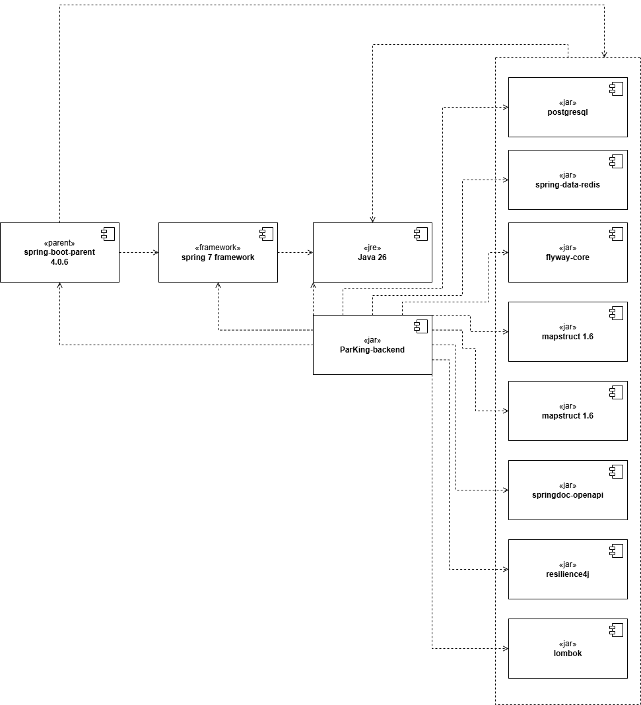
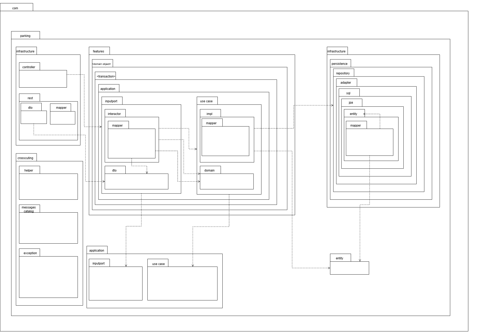
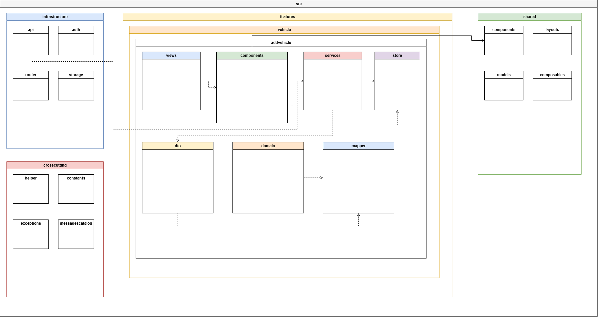

# ParKing - Sistema de Gestión de Parqueaderos

# Diagramas

## Diagrama de Componentes Backend

---

## Diagrama de Componentes Frontend

---

## Diagrama de Paquetes Backend

---

## Diagrama de Paquetes Frontend

---

# Documentación

## Archivos Excel

- [Atributos de Calidad](docs/excel/Atributos-de-Calidad.xlsx)
- [Documentación Arquetipo y Arquitectura de Referencia](docs/excel/Documentación-Arquetipo-y-Arquitectura-de-Referencia.xlsx)
- [Escenarios de calidad](docs/excel/Escenarios-de-Calidad.xlsx)
- [Funcionalidades Críticas](docs/excel/Funcionalidades-Criticas.xlsx)
- [Mapa de Impacto](docs/excel/Mapa-de-Impacto.xlsx)
- [Matriz de Tiempos del Sistema](docs/excel/Matriz-de-Tiempos-del-Sistema.xlsx)
- [Restricciones de Negocio](docs/excel/Restricciones-de-Negocio.xlsx)
- [Restricciones Técnicas](docs/excel/Restricciones-Técnicas.xlsx)
